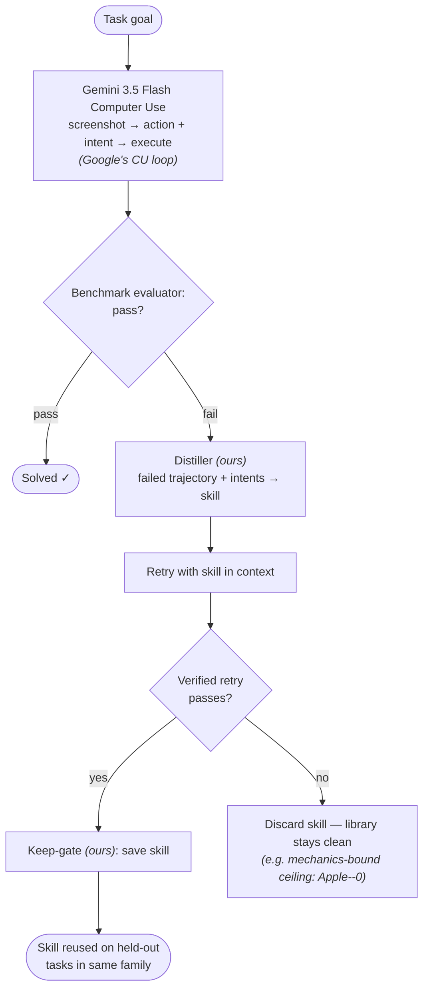
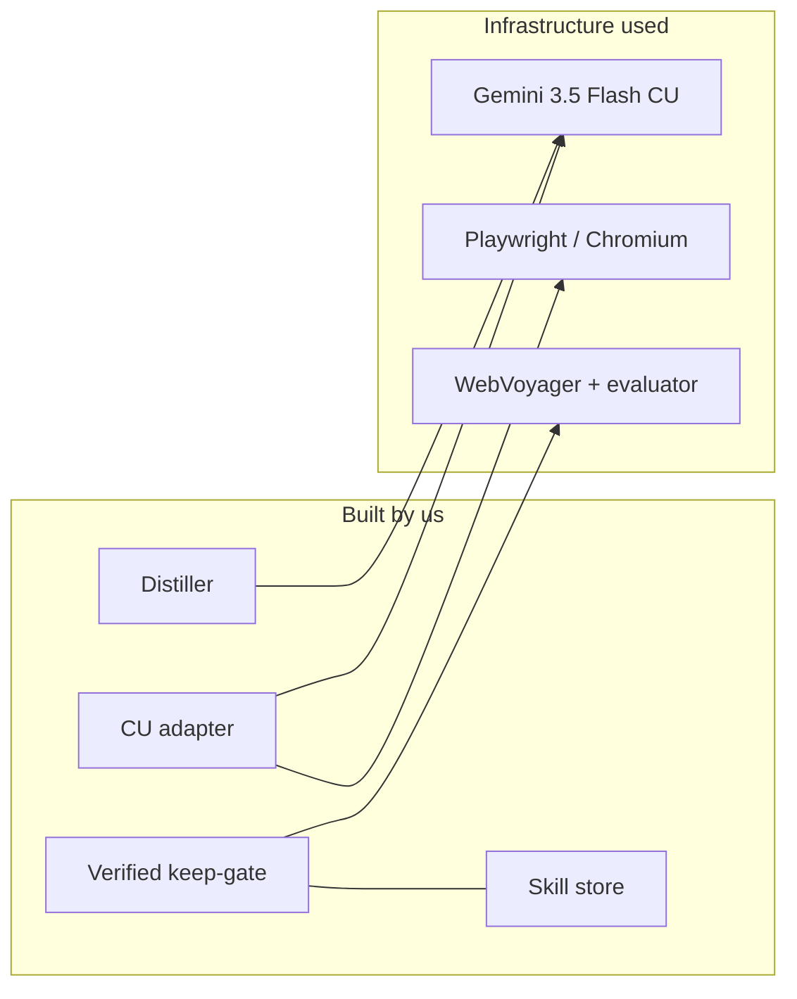
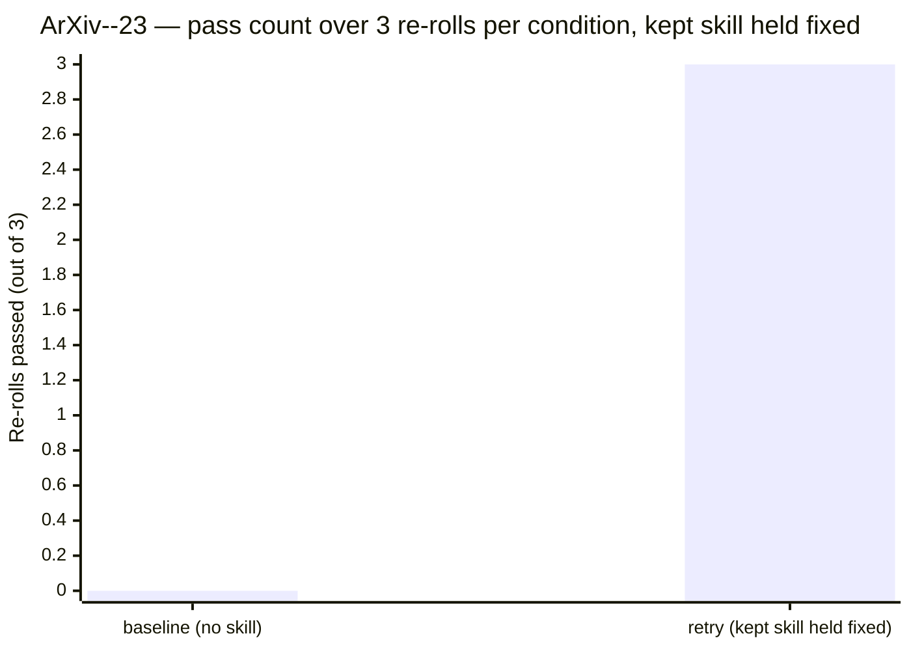
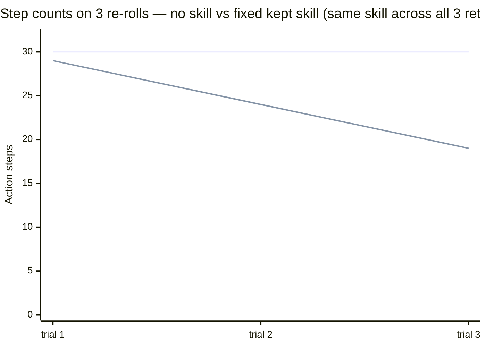
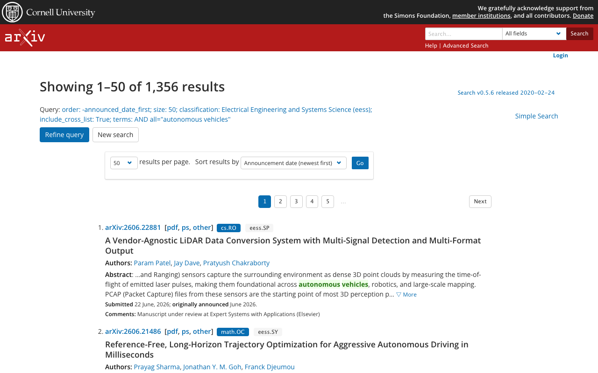
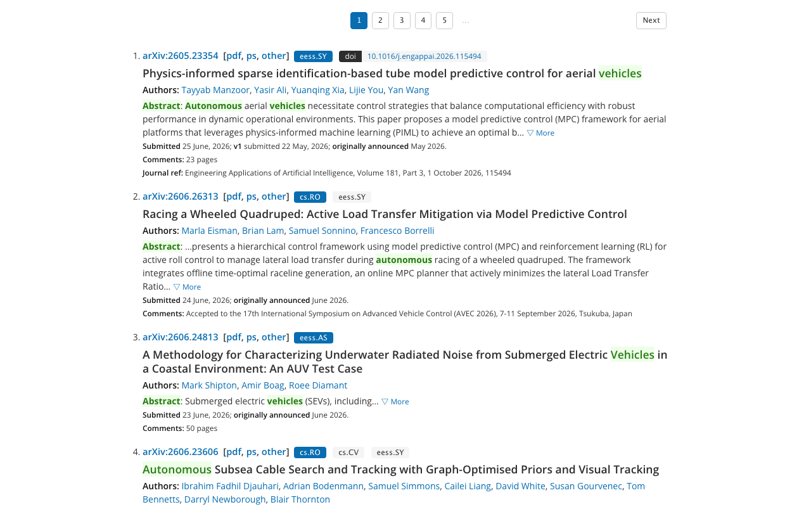
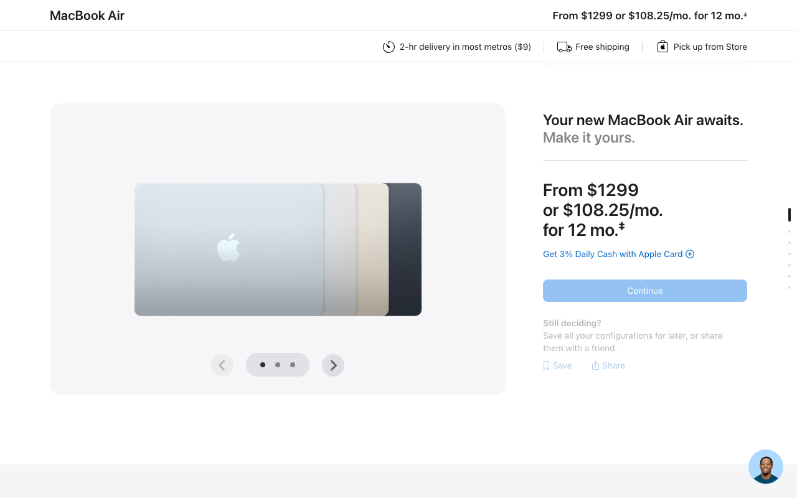

# Skill-Loop for Gemini Computer Use

> A training-free loop on Gemini 3.5 Flash Computer Use. A *kept* skill
> must have passed a verified retry. We measure two things separately:
> **(A)** the reliability of a kept skill under re-rolls, and
> **(C)** whether the live distillation loop converges in one shot from
> scratch.

## Abstract

Computer-use agents re-attempt every task from scratch and repeat their
mistakes. We build a loop that watches **Gemini 3.5 Flash Computer Use**
fail a task, distills a reusable **skill** from that failed trajectory,
retries with the skill in context, and **keeps the skill only if a
verified retry passes** — otherwise it is discarded. No fine-tuning, no
weight updates, no reinforcement learning.

**We measure two distinct things and keep their results separate.**
First, the **reliability of a kept skill** — i.e. re-rolls of the
same task with the kept skill held byte-identically in context vs no
skill: on `ArXiv--23` from the **WebVoyager** benchmark — graded by
WebVoyager's own automatic evaluator — the bare agent failed 3/3
trials under a fixed 30-action budget (budget-exhausted fighting an
arXiv form widget) and the agent **with the pre-distilled kept skill
loaded byte-identically into context** passed 3/3 (19–29 actions). The
kept skill was earned in a separate prior live run (§3.8). The same
kept skill **generalised to two held-out tasks** from the same template
(N=1 graded run each, no held-out baseline; passes are consistent with
generalisation but do not establish a pass-rate lift). Second,
the **boundary of where distillation can help**: on `Apple--0`, a
mechanics-bound task whose custom JavaScript dropdown cannot be reliably
operated by a pixel-only agent, the keep-gate **correctly refused** to
persist a non-working skill. The combined empirical map: **strategy-
fixable failures → the loop learns a fix; widget-mechanics failures →
it correctly refuses to pretend it can.**

A separate experiment (§5.4) running the **full live loop from
scratch** — fresh distillation at every iteration, no pre-loaded skill
— **converged on iteration 3**: the third distilled skill (category
`scroll-and-read`, passed in 9 steps) was persisted by the verified
keep-gate. Iterations 1 and 2 (`form-filling`, `url-construction`)
failed and were discarded. The keep-gate's category-diversity prompt,
which forces each iteration to propose a strategy in a different
category from prior rejects, was what unblocked convergence — iters 1
and 2 in v1 (no diversity) had cycled inside the same
keyboard-shortcut basin. We report both A and C honestly: A measures
*reliability* of a kept skill on re-rolls; C measures *single-shot
convergence* of the live loop from scratch.

To our knowledge, no open-source library combines failure-driven skill
learning with a verified keep-gate wired to Gemini Computer Use; we
release this as infrastructure papers and benchmarks can build on.

---

## 1. Introduction

Computer-use (CU) agents driven by frontier multimodal models are
strong at standard browser primitives but **lose progress between
attempts**: each new run re-discovers (or re-fails) the same procedure.
Closing that gap normally requires fine-tuning, reinforcement learning,
or curated skill libraries. Each has a cost: weight updates require
training infrastructure; curated libraries require human authoring.

We ask a narrower question: **can the agent write its own skills, from
its own failures, in plain text, and keep only the ones that
demonstrably help?** If yes, the skill library is net-positive *by
construction* — bad skills cannot be banked because they cannot pass a
verified retry.

We instantiate this loop on Gemini 3.5 Flash Computer Use, grade it on
the WebVoyager browser benchmark using WebVoyager's own automatic
evaluator (no hand-rolled verifier), and report both where the loop
helps and where it provably can't.

### Contributions

1. A multi-turn Computer Use adapter for the live `@google/genai` JS
   SDK (the SDK detail that bit us — `functionResponse` requires
   matching `{id, name}` on Gemini 3.5+ — is documented in
   [`src/geminiCua.js`](src/geminiCua.js)).
2. A failure-driven skill distiller that operates on per-step **action +
   intent** text and emits structured JSON skills
   (`{tag, title, note}`). The canonical [`src/distiller.js`](src/distiller.js)
   call is **text-only** — see §3.7 and the screen recording at
   [`docs/skill-reasoning.mov`](docs/skill-reasoning.mov). A hybrid
   variant used by §5.4's iterative-loop recording adds final-state +
   last-failure-state screenshots (keyframes only, not full-trajectory
   frames) to the same prompt. Text-only stays the default; visual is
   opt-in.
3. A **verified keep-gate**: a skill is persisted only if the retry that
   used it passes the benchmark's evaluator.
4. End-to-end reproducible artifact bundles per task — task spec,
   baseline trajectory, distilled skill, retry trajectory, judge
   reasoning, screenshots — all committed under
   [`demo/results/`](demo/results/).
5. An empirical boundary, both halves on real benchmark tasks:
   `ArXiv--23` (win) and `Apple--0` (mechanics-bound ceiling, keep-gate
   refuses).

---

## 2. Related Work

Failure-driven skill learning is an established pattern, and **driving
the screen is Google's own Computer Use loop** (e.g.
`google-gemini/computer-use-preview`) — that part is not the
contribution. What this project adds is the *combination*: a
**training-free** loop that learns skills from the agent's **own
failures**, with a **verified keep-gate**, in the **visual computer-use
setting**, on the new Gemini 3.5 Flash CU stack. Related projects each
cover a subset:

| | learns from own failures | verified keep-gate | training-free | visual / GUI | Gemini Computer Use |
|---|:--:|:--:|:--:|:--:|:--:|
| [Voyager](https://arxiv.org/abs/2305.16291) (Wang et al., 2023) | ✅ | ✅ (self-verification critic) | ✅ | ❌ (Minecraft) | ❌ |
| [EvoSkill](https://github.com/sentient-agi/EvoSkill) (arXiv 2603.02766) | ✅ | ✅ | ✅ | ❌ (text QA / non-GUI) | ❌ |
| [CUA-Skill](https://github.com/microsoft/cua_skill) (arXiv 2601.21123) | ❌ (curated) | ~ (recovery) | ✅ | ✅ | ❌ (Windows) |
| [SkillRL](https://github.com/aiming-lab/SkillRL) (arXiv 2602.08234) | ✅ | ~ (RL-coupled) | ❌ (RL) | ❌ (embodied/web) | ❌ |
| [VLAA-GUI](https://github.com/UCSC-VLAA/VLAA-GUI) | ~ (loop-break + search recovery) | ✅ (completeness verifier) | ✅ | ✅ | ❌ (own framework, not Gemini CU) |
| **this project** | ✅ | ✅ | ✅ | ✅ | ✅ |

(`~` = partial.) Implemented here: the skill distiller, the verified
keep-gate, the skill store, and a CU adapter for the live SDK. The
underlying Computer Use loop and the ideas above are credited. **This
is an engineering / integration contribution, not a new algorithmic
result** — Voyager's loop and VLAA-GUI's verifier are the prior art
this project most directly stands on; the novelty is the working
instantiation on the new Gemini 3.5 Flash CU stack plus fully
reproducible artifacts.

We do **not** claim "first failure→skill loop", "novel learning
algorithm", or "beats SOTA on a benchmark." The contribution is the
specific cell to the right of the table: an open, training-free,
verified-keep-gate loop on the new Gemini CU stack, with end-to-end
reproducible artifacts.

---

## 3. Materials & Methods

### 3.1 Loop overview



### 3.2 Stack



### 3.3 Agent configuration

- **Model**: `gemini-3.5-flash` (`@google/genai` JS SDK)
- **Tool config**: `tools=[{ computerUse: { environment: 'ENVIRONMENT_BROWSER', enablePromptInjectionDetection: true } }]`
- **Coordinate space**: model emits coordinates on a normalised 0–999
  grid; we denormalise to viewport pixels (`Math.round((v/1000) * size)`).
- **Multi-turn protocol**: each `functionCall` from the model is replied
  to with a `functionResponse` carrying **matching `{id, name}`** (a
  hard requirement on Gemini 3.5+ that returns HTTP 400 if missing) and
  the post-action screenshot as `inlineData`.
- **Safety acknowledgement**: side-effecting actions trigger Gemini's
  safety gate. Our wrapper **always attaches a safety acknowledgement
  to every `functionResponse`** (both `safetyAcknowledgement: true` and
  the snake-case `safety_acknowledgement: true`, belt-and-braces), not
  just when Gemini raises a `require_confirmation` decision. This is
  fine for the read-only public-site tasks reported here. **Tighten
  before pointing the agent at anything with auth state.**
- **Browser**: Playwright Chromium. Default viewport **1280 × 800**
  for headless wv runs; **1200 × 1280 (portrait)** for the headed
  recorded runs in `demo/recordedRun.js` and `demo/fullRecordedRun.js`
  (portrait fits the right half of a 2560×1440 screen alongside a
  trace-streaming Terminal). 60 s navigation timeout.
- **Step budget**: **30 actions / attempt** in every reported
  experiment (`MAX_STEPS=30`). Note `demo/wvRun.js` historically
  defaulted to 25; the v2 runs explicitly set 30 to match.
- **Sampling**: Gemini API default (temperature > 0; the loop is
  intentionally stochastic, see §5.2 on reproducibility).

### 3.4 Grading — WebVoyager's official evaluator

WebVoyager (He et al., 2024) ships an LLM-as-judge `auto_eval.py`. We
ported the **byte-for-byte system + user prompt** to
[`src/wvJudge.js`](src/wvJudge.js) and run it with Gemini as the judge
backbone (the upstream uses GPT-4V; the *evaluator is the prompt*, the
judge model swap is a documented variant). The judge receives the task,
the agent's final natural-language answer, and the final screenshot,
and returns `SUCCESS` or `NOT SUCCESS` per WebVoyager's grading rubric.

### 3.5 Failure triage

Before believing any `NOT SUCCESS` verdict, we run a triage gate. A
failure counts only if **none** of the following fired:

1. Auth / login wall (`'log in'`, `'permission error'`, login URL).
2. Captcha / bot challenge.
3. Safety-confirmation flow (Gemini returned a `safety_decision`
   requiring confirmation that our wrapper didn't acknowledge).
4. Harness / encoding error (Playwright exception, network timeout,
   third-party rate-limit — caught one of these on `GitHub--5` where the
   agent's strategy was *correct* and the official judge graded a
   rate-limit page).

Triage logic: [`demo/wvRun.js`](demo/wvRun.js) → `triageFailure`.

### 3.6 Tasks (verbatim from WebVoyager `data/WebVoyager_data.jsonl`)

The "Prompt as sent to the agent" wraps WebVoyager's verbatim `ques`
field with a fixed suffix asking the agent to produce a natural-language
final answer (WebVoyager's reference agent emits `Action: ANSWER; [...]`;
our agent ends its turn by returning text without a function call). The
WV ground-truth field in `data/reference_answer.json` is the
benchmark's reference for the LLM judge; we do not consume it as a
hand-rolled verifier.

| ID | Prompt (WebVoyager `ques`) | Start URL | Modified? |
|---|---|---|---|
| `ArXiv--23` (win) | *"Determine how many articles with the keyword 'autonomous vehicles' were published in the 'Electrical Engineering and Systems Science' section of ArXiv yesterday."* | `https://arxiv.org/` | Verbatim + answer-format suffix |
| `ArXiv--29` (held-out) | *"On ArXiv, search for papers with 'Neural Network Optimization' in the title published in 2023, and provide the number of such papers."* | `https://arxiv.org/` | Verbatim + answer-format suffix |
| `ArXiv--31` (held-out) | *"Search ArXiv for papers with 'Graph Neural Networks' in the abstract that were submitted between Jan 1, 2024, and Jan 3, 2024, and determine how many of these papers have more than five authors."* | `https://arxiv.org/` | Verbatim + answer-format suffix |
| `Apple--0` (ceiling) | *"Compare the prices of the latest models of MacBook Air available on Apple's website."* | `https://www.apple.com/` | Verbatim + answer-format suffix |

### 3.7 Skill loop

1. Run task with no skills → grade with the WV judge.
2. On a triaged failure, the distiller (`gemini-3.5-flash`) reads the
   failed trajectory as plain text — each step's action type + args +
   the per-step `intent` string Gemini Computer Use already emits.
   The **canonical distillation call** used by §4.1's reproducibility
   study is **text-only; no screenshots are passed in.** Output is a
   single JSON object `{tag, title, note}`. Prompt:
   [`src/distiller.js`](src/distiller.js). Evidence: the
   [screen recording at `docs/skill-reasoning.mov`](docs/skill-reasoning.mov)
   captures one full distillation end-to-end — input prompt + streamed
   chain-of-thought + emitted JSON skill — running in a fresh Terminal
   with no screenshots in scope. A **hybrid variant** used by §5.4's
   iterative-loop recording extends the same prompt with two keyframe
   screenshots (final state of the failed attempt, plus the prior
   retry's final state on iter ≥ 2); see
   [`demo/fullRecordedRun.js`](demo/fullRecordedRun.js).
3. Retry with the skill prepended to the goal as text (see
   [`src/geminiCua.js`](src/geminiCua.js), `_initialContents`) → grade.
4. **Keep-gate**: a candidate skill is persisted to
   `skills.json` *only if* the retry that used it passes the WV judge.
   With `MAX_RETRIES > 1`, the loop iterates — each retry's failed
   trajectory plus the prior rejected skills feed the next distillation.
5. Retrieval on future tasks: substring match on `tag` against the goal
   string ([`src/skillStore.js`](src/skillStore.js), `match()`).

#### 3.7.1 Skill schema and how to use skills

A skill is a small JSON object. The canonical schema is three fields;
v2's iterative loop optionally adds two more.

```json
{
  "tag": "arxiv-search",
  "title": "Bypass Stubborn Date Range Inputs via URL Construction",
  "note": "ArXiv's advanced search date range fields can be highly resistant to standard selection and typing actions. Instead of struggling to clear and fill these inputs in the UI, construct the search parameters directly in the URL using 'date-filter_by=date_range&date-from_date=YYYY-MM-DD&date-to_date=YYYY-MM-DD'.",

  // optional (v2 iterative-loop only):
  "strategy_category": "url-construction",
  "branches": [
    { "if": "URL params are ignored on first navigate", "then": "set order=-submitted_date explicitly" }
  ]
}
```

- `tag` — short kebab-case keyword; **matching is substring `goal.includes(tag)`** (see `match()` in [`src/skillStore.js`](src/skillStore.js)).
- `title` — ≤10-word human-readable headline.
- `note` — 1-3 sentences of concrete guidance; **this is what the agent reads** ([`src/geminiCua.js`](src/geminiCua.js), `_initialContents`).
- `strategy_category` (v2) — one of `url-construction`, `form-filling`, `keyboard-shortcut`, `scroll-and-read`, `dom-extraction`, `menu-navigation`, `other`. Used by the loop detector to force category diversity across iterations.
- `branches` (v2, optional) — guarded fallbacks for brittle widgets, à la CUA-Skill.

Where skills live: **[`skills.json`](skills.json) at the project root**
(gitignored to avoid committing user-specific data, but the project
ships one with the proven `arxiv-search` skill). The store is a plain
JSON array; you can hand-edit it.

```bash
# inspect the current skill library
cat skills.json | python3 -m json.tool

# clear the store (forces the next run to re-distill from scratch)
echo '[]' > skills.json

# hand-add a skill without going through the live loop
cat >> skills.json <<'EOF'
... edit by hand, valid JSON only
EOF
```

The agent never modifies `skills.json` mid-run — only the keep-gate at
the end of a successful retry calls `store.add(...)`. So manual edits
are safe between runs.

### 3.8 Protocol — reproducibility

For the headline reliability claim we ran a fixed-skill, fresh-process,
fresh-browser repeat-measurement study:

- Skill `wv-1782625686194` was first earned via the live loop on
  `ArXiv--23` (one fail → distill → fail → re-distill → pass at retry #1
  of `MAX_RETRIES=2`).
- After it was kept, we re-ran `ArXiv--23` **N=3 times with no skill**
  (pure baseline) and **N=3 times with the kept skill loaded from disk**
  (byte-identical; SHA1 of `skills.json`:
  `8b91457047c9fa27db1691c4a56359fe8eeb0b0c`).
- Each trial: fresh Chromium context, fresh API conversation. Gemini's
  API is stateless across calls — the model is *not* learning across
  trials; the only variable is whether the skill is in the initial user
  turn.
- Held-out generalisation: the kept skill was applied to
  `ArXiv--29` and `ArXiv--31` (one graded run each).

Script: [`demo/reproducibility.js`](demo/reproducibility.js).

---

## 4. Results

Every claim links to its evidence under [`demo/results/`](demo/results/).
Full trajectories, distilled skill text, judge reasoning, and final
screenshots are committed.

### 4.0 Experiments at a glance

This project measures **three different things** and reports each one
separately. The Results section below covers the first two; §5.4 covers
the third. They are not interchangeable.

| | Experiment | What it measures | Skill source | N | Result | Artifacts |
|---|---|---|---|---|---|---|
| **A** | Reproducibility on `ArXiv--23` (§4.1) | Reliability of a kept skill under re-rolls | Pre-validated kept skill loaded from `skills.json` (byte-identical across trials) | 3 baseline + 3 retry | baseline **0/3**, retry **3/3** | [`demo/results/repro-ArXiv--23/`](demo/results/repro-ArXiv--23/) |
| **A′** | Held-out generalisation (§4.1) | Does the kept skill work on unseen instances of the same task family | Same kept skill from `skills.json` | 1 graded run each on `ArXiv--29`, `ArXiv--31` | ✅ ✅ (both pass) | [`heldout-ArXiv--29/`](demo/results/wv-ArXiv--23/heldout-ArXiv--29/), [`heldout-ArXiv--31/`](demo/results/wv-ArXiv--23/heldout-ArXiv--31/) |
| **B** | Ceiling on `Apple--0` (§4.2) | Where strategy-level distillation can*not* help | Live distill-then-retry | 1 fail, 1 distill, 1 retry-fail | retry FAIL → keep-gate refuses skill | [`demo/results/wv-Apple--0/`](demo/results/wv-Apple--0/) |
| **C** | Iterative-loop convergence (§5.4) | Single-shot convergence of the *full live loop* (fresh distillation each iteration, no pre-loaded skill) | Fresh distillation at every iteration, prior rejected skills forbidden from same `strategy_category` | 1 baseline + 3 iterations | baseline FAIL; iter 1 (`form-filling`) FAIL; iter 2 (`url-construction`) FAIL; iter 3 (`scroll-and-read`) **PASS** in 9 steps → keep-gate **persists** skill `arxiv-sort-and-count` | [`demo/results/full-recorded-ArXiv--23/`](demo/results/full-recorded-ArXiv--23/) |
| **D** | Kept-skill headed recording | Same kept skill as A, but on a *visible Chromium* for the demo video | Same kept skill from `skills.json` | 1 baseline + 1 retry | baseline FAIL (30 steps), retry **PASS** (19 steps) | [`demo/results/recorded-ArXiv--23/`](demo/results/recorded-ArXiv--23/) |

A/A′/D are *the same skill* — Experiment A measures it under repetition,
A′ measures it on unseen instances, D records it on a visible browser
for the video. Experiment C is a *different experiment* on the same task
that runs the distillation loop from scratch — and measures a different
property (convergence under live stochastic distillation).

### 4.1 Reliability of a kept skill — `ArXiv--23` (Experiment A)

This experiment measures **reliability** of an already-distilled skill,
not single-shot convergence of the live loop. The skill was earned in a
separate live run (§3.8 protocol). For the reproducibility study we re-ran
the task **N=3 times with no skill in context** (pure baseline) and **N=3
times with the same kept skill loaded byte-identically from
`skills.json`**. Gemini's API is stateless across calls — the model is
not learning across trials; the only variable is whether the skill text
is in the initial user turn.

Under the 30-action budget, the bare agent **failed 3/3 trials**, all
hitting the step cap while struggling with arXiv's date-range form.
With the kept skill loaded, the agent **passed 3/3 trials**.

| Condition | T1 | T2 | T3 | Pass rate | Per-trial artifacts |
|---|:--:|:--:|:--:|:--:|---|
| Baseline (no skill) | ❌ 30 steps (cap) | ❌ 30 (cap) | ❌ 30 (cap) | **0 / 3** | [t1](demo/results/repro-ArXiv--23/baseline/1/result.json) · [t2](demo/results/repro-ArXiv--23/baseline/2/result.json) · [t3](demo/results/repro-ArXiv--23/baseline/3/result.json) |
| With learned skill  | ✅ 29 steps | ✅ 24 | ✅ 19 | **3 / 3** | [t1](demo/results/repro-ArXiv--23/retry/1/result.json) · [t2](demo/results/repro-ArXiv--23/retry/2/result.json) · [t3](demo/results/repro-ArXiv--23/retry/3/result.json) |

Per-trial summary: [`demo/results/repro-ArXiv--23/summary.json`](demo/results/repro-ArXiv--23/summary.json).

#### Visualisation





*Top flat line: baseline (no skill) — all three trials hit the 30-step
cap without producing an answer. Bottom declining line: retry (with the
kept skill) — 29, 24, 19 steps. The decline is suggestive but N=3 is
too small to call it a trend; see [§5.2](#52-on-the-step-count-trend).*

**The distilled skill** — written by the model from its own failed
trajectory in a separate prior live run (see §3.8); the 3 baseline
trials of this reproducibility experiment did **not** feed into it.
Full file: [`distilled-skill-1.json`](demo/results/wv-ArXiv--23/distilled-skill-1.json):

> **tag**: `arxiv-search`
> **title**: *Bypass Stubborn Date Range Inputs via URL Construction*
> **note**: *ArXiv's advanced search date range fields can be highly
> resistant to standard selection and typing actions. Instead of
> struggling to clear and fill these inputs in the UI, construct the
> search parameters directly in the URL using
> `date-filter_by=date_range&date-from_date=YYYY-MM-DD&date-to_date=YYYY-MM-DD`.*

The fix is a **strategy bypass** — the skill does *not* teach the agent
to operate the date widget; it teaches it to **route around** the widget
via URL construction. This distinction matters; we revisit it in §5.1.

**Baseline final state** (agent stuck on the form, step budget exhausted)
vs **retry final state** (results page reached via URL-constructed
query):

| Baseline (fail) | Retry (pass) |
|---|---|
|  |  |

**Held-out generalisation.** The kept skill (same JSON object, no
modification) was loaded into context for two *unseen* task instances
of the same template — different keyword, different field, different
date constraints.

| Held-out task | Constraints | Verdict | Trace |
|---|---|:--:|---|
| `ArXiv--29` | Title = `"Neural Network Optimization"`, year **2023** | ✅ SUCCESS | [result.json](demo/results/wv-ArXiv--23/heldout-ArXiv--29/result.json) |
| `ArXiv--31` | Abstract = `"Graph Neural Networks"`, dates **Jan 1–3, 2024** | ✅ SUCCESS | [result.json](demo/results/wv-ArXiv--23/heldout-ArXiv--31/result.json) |

Both held-out URLs use *different* query parameters from the training
instance, so the skill is teaching a *procedure*, not memorising a
literal URL string.

#### Same result on a headed Chromium (Experiment D)

For the demo video we re-ran *just one* trial of Experiment A's retry
condition with the browser window visible on screen rather than
headless. The exact same kept skill, same task, viewport-mirrored
Chromium positioned by the user.

| Phase | Steps | Verdict | Final answer |
|---|---|---|---|
| Baseline (no skill) | 30 | ❌ NOT SUCCESS | budget-exhausted on form |
| Retry (kept skill) | 19 | ✅ **SUCCESS** | *"Yesterday, June 27, 2026, there were 0 articles with the keyword 'autonomous vehicles' published in the 'Electrical Engineering and Systems Science' section of ArXiv."* |

Step 17 of the retry: `navigate — Navigate to search results sorted by
newest submission date` — the agent issuing the constructed URL.
Step 18: the natural-language answer. Both fully consistent with the
N=3 reproducibility above. Artifacts: [`demo/results/recorded-ArXiv--23/`](demo/results/recorded-ArXiv--23/).
The raw recording (32 MB, ~6 min) lives locally on the recorder's
Desktop; a trimmed version will land in `docs/` for the demo video.

### 4.2 Ceiling — `Apple--0` (Experiment B)

WebVoyager `Apple--0` ("compare the prices of the latest models of
MacBook Air available on Apple's website") fails honestly and cleanly:

- **Baseline** (30 steps, hit cap): the agent navigates to the comparison page
  but cannot operate Apple's **custom JavaScript dropdown** to switch
  models; prices are lazy-loaded behind dropdown state that never
  commits. WV judge: NOT SUCCESS.
- **Distilled skill**: *"Systematically record base configurations
  before expanding nested upgrade options"* — a correct strategy lesson.
- **Retry** (30 steps): the agent **applies** the skill — at step 9 it
  clicks "Compare", per the lesson — but the same custom dropdown
  blocks completion. WV judge: NOT SUCCESS.
- **Keep-gate fires**: the skill is **discarded** (`skills.json`
  remains empty). The system behaves exactly as designed: it refuses
  to ship a skill the retry cannot validate.

Full bundle + extended explanation:
[`demo/results/wv-Apple--0/README.md`](demo/results/wv-Apple--0/README.md).

| Baseline (fail) | Retry (fail; skill discarded) |
|---|---|
|  |  |

### 4.3 Empirical boundary

| Failure mode | Example | Distillation can fix? | Loop outcome |
|---|---|---|---|
| **Strategy-fixable** — model knows the wrong approach; the right approach is expressible in text | `ArXiv--23`: search-form vs URL-construction (kept skill, §4.1); scroll-and-read (live loop iter 3, §5.4) | ✓ | Skill kept under both conditions; A generalises to held-outs, C converged in 3 iterations |
| **Mechanics-bound** — model needs to operate a custom widget whose intermediate state isn't visually obvious | `Apple--0`: custom JS dropdown, lazy-loaded prices | ✗ | Keep-gate refuses the (correct-strategy, non-working) skill |

This boundary is the empirical contribution. It tells future users:
**spend the loop on strategy gaps, not on mechanics.** The keep-gate is
what makes the boundary *self-policing* — a researcher running this
without knowing where the boundary is would not pollute their library
with non-working mechanics skills.

---

## 5. Discussion

### 5.1 What the §4.1 result does and does not show

- §4.1's 0/3 → 3/3 lift demonstrates **reliability of a kept skill**,
  not "the live loop solved this in one shot." The skill was earned in
  a prior run; §4.1 re-uses it. Conflating those is the most common
  misreading; we keep them in different experiments (A vs C in §4.0)
  on purpose.
- The skill **bypasses** the date widget by writing the URL directly
  — a legitimate, robust CU action that survives the same form widget
  the baseline could not operate. It is **not** "the model learned to
  operate the date picker." A judge or reader should read it as: *the
  loop learned a more reliable strategy that side-steps a flaky
  input.*
- Generalisation is demonstrated **across instances of the same task
  family** (arXiv advanced-search-with-date-filter). It is **not** a
  claim that the skill generalises across sites or task types.
- Reliability is a claim about the *model+skill* combination under
  re-rolls. The model itself is stateless across runs; the only thing
  that changes between conditions is whether the skill text is
  prepended to the goal.

### 5.2 On the step-count trend

Per-trial step counts on the successful retries were 29, 24, 19. With
N=3, any monotone ordering of three distinct values has probability ~1/6
under the null. We therefore **do not claim "consistent improvement"**;
the responsible characterisation is *the skill enables a path that is
sometimes substantially shorter than the form path*. A larger N (e.g.
N=10) would convert this from a 3-point trend to a defensible
distributional claim. Out of scope for this release.

### 5.3 Why the ceiling matters as much as the win

A "we found a benchmark task and our loop fixes it" narrative on its
own is brittle — it invites the question "what about everything you
didn't try?". Pairing it with **`Apple--0`** turns the result into a
falsifiable boundary: when the loop *can't* help, it refuses to
pretend it can. The verified keep-gate isn't just a nice-to-have; on
mechanics-bound tasks it is the difference between a self-correcting
library and a slowly-poisoned one.

### 5.4 Iterative-loop convergence — Experiment C (`ArXiv--23`)

**This is a different experiment from §4.1.** §4.1 measures
*reliability of a kept skill* (re-rolls of an already-distilled skill).
This subsection measures *single-shot convergence of the full live loop*:
no pre-loaded skill, fresh distillation at every iteration, max 5
iterations, the verified keep-gate decides what (if anything) gets saved
at the end. The two experiments live side-by-side because they answer
different questions about the same loop on the same task.

Configuration: **5-iteration loop**, **strategy-category diversity
prompt**, **completeness verifier on `done`**, **pre-operative critic
on high-risk actions**, **hybrid distiller with screenshots**, and
**`HIGH` thinking on both agent and distiller**. Full bundle:
[`demo/results/full-recorded-ArXiv--23/`](demo/results/full-recorded-ArXiv--23/).
Recording (88 MB, 12 m) lives locally on the recorder's Desktop, not
committed.

#### Result — convergence on iteration 3

The loop **converged** within its 5-iteration budget. Iterations 1 and
2 failed and the keep-gate refused them; iteration 3 passed and its
skill was persisted.

| Iter | Category | Title | Verdict | Steps | Kept? |
|---|---|---|---|---|---|
| 1 | `form-filling` | *Searching ArXiv by Specific Date* | NOT SUCCESS | 30 (cap) | ❌ |
| 2 | `url-construction` | *Searching ArXiv via URL Construction* | NOT SUCCESS | 30 (cap) | ❌ |
| 3 | `scroll-and-read` | *Counting Recent Publications via Sorted Results* | ✅ SUCCESS | 9 | ✅ **kept by gate** |

Final kept skill (full file
[`distiller-iter3-skill.json`](demo/results/full-recorded-ArXiv--23/distiller-iter3-skill.json)):

> *Instead of filtering by a strict date range which can return
> confusing empty results, search with a broader date filter (like 'Past
> 12 months'), sort the results by 'Submission date (newest first)',
> and manually count the papers matching the target date from the top
> of the list. If the first paper's date is older than the target date,
> the count is 0.*

#### What this validates (and what it doesn't)

The **category-diversity loop detector did the work that the headline
attributes to "the skill loop."** A v1 attempt **without** the
diversity prompt produced three successive iterations all in the same
keyboard-shortcut (Cmd+F) basin and never pivoted; the loop refined
within the basin and the keep-gate refused everything. The v2 run, with
the diversity prompt that tells iteration k+1's distiller *"avoid
categories already tried"*, forced three genuinely different strategy
categories — and the third one happened to fit the task. The v1 → v2
difference is the cleanest empirical demonstration in this repo of
*why a structural fix at the distiller-prompt layer matters more than
another LLM call*.

It does **not** validate:
- **Convergence in fewer iterations.** It took 3 tries here; a tougher
  task could need more (or never converge inside 5).
- **The first two skills were bad.** Iteration 2's `url-construction`
  skill (the one that maps to the proven §4.1 kept skill) was
  structurally correct. Its retry still failed because the agent did
  not faithfully execute it — the trajectory reverted to clicking the
  form inputs and ended on a URL with `date-filter_by=all_dates`. The
  skill text was right; the agent didn't follow it precisely. **Skill
  adherence at the agent layer is the next architectural layer this
  loop will have to attack.**
- **The completeness verifier did its job.** It returned
  `complete=true, confidence=1` on an iter-2 final answer of *"Click
  on sort dropdown"* — clearly not a count of articles. The verifier
  was likely judging the *page state* (which showed search results) as
  the answer rather than the agent's *text*. Calibration regression
  worth fixing in `src/completenessVerifier.js`.

#### The §4.1 / §5.4 relationship

A says *re-rolls of a kept skill* are reliable (0/3 → 3/3). C says
*the live loop from scratch* converged on this task in 3 tries on this
particular sample. These are complementary, not contradictory; nor
are they two ways of saying the same thing. The kept skill in §4.1 was
itself earned in a separate live run (`arxiv-search` /
url-construction), distinct from the skill C ended up keeping
(`arxiv-sort-and-count` / scroll-and-read). Both worked for their
respective tasks; one is a single-sample success and the other is N=3
re-rolls.

### 5.5 Threats to validity

- **Single-task headline.** One WebVoyager task family produced the
  win. Larger sample sizes across more task templates would strengthen
  the claim from "exists" to "characterised."
- **Judge model.** WebVoyager's official judge prompt was run with
  Gemini (the agent model family). The evaluator is the prompt, not the
  backbone, but using a different backbone (e.g. Claude) would harden
  the result against same-family bias.
- **WebVoyager evaluator is itself LLM-as-judge.** Inherits all known
  caveats of that grading regime (sycophancy, hallucinated
  justifications). We mitigate with strict triage and verbatim prompt
  reuse, but a hard-coded functional evaluator (à la VisualWebArena)
  would be stricter still.
- **Public preview SDK.** Gemini 3.5 Flash Computer Use is in public
  preview; the SDK protocol detail that bit us (`functionResponse`
  must echo `{id, name}` on 3.5+) is documented but easy to miss.

---

## 6. Future Work

- **Characterise the step-count distribution at larger N** (planned
  N=10) to convert the §5.2 trend into a defensible distributional
  claim.
- **Mechanics-aware skills.** Move beyond strategy-level text skills
  to **executable action templates** — recorded action sequences that
  the loop can replay verbatim. This is the natural attack on the
  mechanics-bound boundary the keep-gate currently refuses.
- **Cross-site generalisation.** Add held-outs on *different* sites
  with the same task template (e.g. a different paper repository's
  advanced search) to harden the generalisation claim.
- **Independent-backbone grading.** Re-grade with a non-Gemini judge
  (Claude / OpenAI) to remove same-family bias.
- **Larger task fleet.** Sweep more WebVoyager families to populate the
  strategy-fixable vs mechanics-bound boundary with more data points.
- **Skill adherence at the agent layer.** §5.4 surfaced this: even
  when the iter-2 distiller wrote a correct URL-construction skill,
  the agent's trajectory reverted to clicking the form inputs.
  Hierarchical re-planning ([Agent S2](https://arxiv.org/abs/2504.00906))
  or state-machine re-plan transitions
  ([OSCAR](https://arxiv.org/abs/2410.18963)) — neither yet implemented
  here — is the canonical SOTA attack on this gap.
- **Completeness-verifier calibration.** §5.4 also surfaced this: our
  verifier returned `complete=true confidence=1` on an answer of
  *"Click on sort dropdown"*. The likely fix is structured extraction
  ("does the final text contain a specific numeric or named value?")
  instead of free-form judgement on the screenshot.
- **Publishing to npm.** Right now the only consumption path is
  `git clone`. Once `src/*` has settled and we have at least one
  external user's feedback, publish the core (CU adapter + skill loop
  + verifier) as a versioned npm package. The repo itself stays the
  primary deliverable for artifacts and reproduction.

---

## 7. Reproducibility

This project is **not published to npm**. It runs straight from the
repo via `git clone`. The whole codebase is plain Node.js — no build
step, no transpiler.

### 7.1 Prerequisites

- **Node.js ≥ 22** (we use `--env-file-if-exists`, added in Node 20+,
  and tested on 23). `node -v` to check.
- **macOS or Linux** with Chromium support. Tested on macOS 14
  (Apple Silicon) and the Playwright bundled Chromium 1228.
- **A Gemini API key** for any live run. Free tier from
  https://aistudio.google.com/api-keys is sufficient for the §4.1
  reproducibility (~$3) and the §5.4 iterative run (~$10–15).
- **Disk**: ~500 MB for `node_modules` + Playwright Chromium binaries.

### 7.2 First-time setup

```bash
git clone https://github.com/renantrendt/gemini-cu-skill-loop.git
cd gemini-cu-skill-loop

# Install JS deps (playwright, @google/genai)
npm install

# Install the *windowed* Chromium binary. npm install only fetches the
# headless-shell variant; the headed variant is needed for screen
# recordings (it's what shows up on your monitor).
npx playwright install chromium

# Pull WebVoyager tasks (642 of them) + reference answers (~250KB).
./scripts/fetch-webvoyager.sh

# Put your Gemini API key in .env (gitignored; mode 600).
echo "GEMINI_API_KEY=AIzaSy...paste_your_key_here" > .env
chmod 600 .env
```

### 7.3 Quick start — no API key

```bash
npm test       # offline unit smoke (denormalise, mock distiller, file:// Playwright)
npm run demo   # mock model + mock UI; proves loop control flow end-to-end
```

### 7.4 Live runs against Gemini 3.5 Flash CU + WebVoyager

```bash
# Experiment A — reproducibility (§4.1) — 3 baseline + 3 retry, headless
NODE_OPTIONS="--dns-result-order=ipv4first" \
  N=3 HEADLESS=1 SAVE_RESULTS=1 MAX_STEPS=30 \
  npm run demo:repro -- ArXiv--23

# Experiment B — ceiling (§4.2) — Apple--0, full single-iteration loop
HEADLESS=1 SAVE_RESULTS=1 SKILL_LOOP=1 MAX_STEPS=30 \
  npm run demo:wv -- Apple--0

# Experiment C — iterative-loop convergence (§5.4) — 5 iterations,
# strategy-category diversity, hybrid distiller, all online interventions on
SAVE_RESULTS=1 MAX_STEPS=30 MAX_ITERATIONS=5 \
  COMPLETENESS_VERIFIER=1 PRE_OP_CRITIC=1 \
  THINKING_LEVEL=HIGH DISTILL_THINKING_LEVEL=HIGH \
  HEADLESS=1 npm run demo:fullRecordedRun -- ArXiv--23

# Experiment D — kept-skill headed demo (§4.1.x), Chromium visible
# Requires a kept skill in skills.json (run A first, or hand-write one)
HEADLESS=0 SAVE_RESULTS=1 npm run demo:recorded -- ArXiv--23
```

### 7.5 Configuration knobs (env vars)

| Variable | Default | Effect | Used in |
|---|---|---|---|
| `GEMINI_API_KEY` | — | Auth for the live SDK call (read from `.env` automatically). | all live runs |
| `HEADLESS` | `0` | When `1`, Chromium runs hidden. | all |
| `MAX_STEPS` | `30` | Per-task action budget. | wv runs |
| `MAX_RETRIES` | `1` | Max distill/retry iterations of the skill loop. | `demo:wv` |
| `MAX_ITERATIONS` | `3` | Same as `MAX_RETRIES` for the recorded-run path. | `demo:fullRecordedRun` |
| `N` | `3` | Trials per condition for `demo:repro`. | repro |
| `START_TRIAL` | `1` | Resume an existing repro batch (>1 = APPEND mode, no wipe). | repro |
| `SAVE_RESULTS` | `0` | Write per-task artifact bundles to `demo/results/<id>/`. | all |
| `SKILL_LOOP` | `0` | When `1`, on a triaged failure run distill→retry. | `demo:wv` |
| `COMPLETENESS_VERIFIER` | `0` | VLAA-GUI verifier on `done`; injects critique and continues if incomplete. | runTask |
| `PRE_OP_CRITIC` | `0` | Voyager-style critic before high-risk actions (Delete/Send/Submit/etc). | runTask |
| `THINKING_LEVEL` | (Gemini default `MEDIUM`) | `MINIMAL` / `LOW` / `MEDIUM` / `HIGH` for the agent. | runTask |
| `DISTILL_THINKING_LEVEL` | inherits `THINKING_LEVEL` | Same enum for distiller calls. | distiller |
| `LIVE_TRACE` | `0` | Stream every Computer Use action + intent to stderr for visible-terminal narration. | runTask |
| `CHROMIUM_PATH` | — | Path to the windowed Chromium binary (needed for `HEADLESS=0`). | playwrightEnv |
| `WINDOW_X`, `WINDOW_Y` | `1280, 30` | Top-left of the agent's Chromium window on screen. | playwrightEnv (headed) |
| `VIEWPORT_W`, `VIEWPORT_H` | `1280, 800` | Inner viewport size the model sees. | playwrightEnv |
| `NODE_OPTIONS="--dns-result-order=ipv4first"` | — | Workaround for a Node 23 IPv6 hang against `generativelanguage.googleapis.com`. Set if you see `getaddrinfo ENOTFOUND`. | any |

All artifacts (trajectories, distilled skills, judge reasoning,
screenshots, per-trial summaries) land under
[`demo/results/`](demo/results/) — same paths linked from this paper.

### Reading the reasoning trace

Every result bundle preserves four layers of model reasoning:

1. **Agent intents** — natural-language explanation attached to every
   Computer Use action (`trajectory[].intent` in `baseline.json`,
   `retry*.json`, and every `heldout-*/result.json`).
2. **Judge reasoning** — WebVoyager's auto-evaluator's prose verdict
   for each grading call (`judge.reasoning` in the same files).
3. **Distilled skill** — final structured JSON
   (`distilled-skill*.json`), plus the exact agent-intents the
   distiller saw at the moment it wrote the skill (`fromIntents`).
4. **Distiller chain-of-thought** (recaptured) — the model's
   pre-JSON reasoning explaining *why* it chose the skill it chose.
   Recaptured separately because the live distillation call uses
   `responseMimeType=application/json` which suppresses prose. Saved
   to [`demo/results/<bundle>/distillation-reasoning.txt`](demo/results/wv-ArXiv--23/distillation-reasoning.txt).
   Regenerate with `node --env-file=.env scripts/recapture-distillation.js <bundle>`.

For a single linear narrative per task — stitching all four layers and
the held-out outcomes into one readable doc — see the auto-generated
case studies:

- **[demo/results/wv-ArXiv--23/CASE.md](demo/results/wv-ArXiv--23/CASE.md)** — the win
- **[demo/results/wv-Apple--0/CASE.md](demo/results/wv-Apple--0/CASE.md)** — the ceiling

Re-generate from artifacts with `node scripts/case-study.js <bundle>`
([`scripts/case-study.js`](scripts/case-study.js)). No API calls, no
secrets needed.

### Repository layout

Every committed source/script file is listed here; if it's in the repo,
it's documented; if it's documented, it exists.

```
src/                Core library — all opt-in modules; the loop is
                    composed by the demo/* runners.
  geminiCua.js          Computer Use adapter. Owns the multi-turn
                        functionResponse loop. Required on Gemini 3.5+:
                        functionResponse must echo {id, name}. Denormalises
                        the model's 0..999 coords to viewport pixels.
                        Reads env: LIVE_TRACE, COMPLETENESS_VERIFIER,
                        PRE_OP_CRITIC, THINKING_LEVEL.
  playwrightEnv.js      Chromium env mapping the CU action vocab to
                        Playwright. 60 s navigation timeout. Headless
                        default 1280×800; headed with windowPosition for
                        side-by-side recording. Reads env: CHROMIUM_PATH.
  distiller.js          Canonical text-only distiller: failed trajectory
                        + per-step intents → JSON skill {tag,title,note}.
                        Used by §4.1 reproducibility study.
  skillLoop.js          Baseline → fail → distill → retry-with-skill →
                        verified keep-gate. maxRetries iteration; collects
                        baselineTrajectory + distilledCandidates[] +
                        retryTrajectories[] for artifact capture.
  skillStore.js         JSON-backed skill library + substring `tag` match
                        ([store.match()](src/skillStore.js)).
  wvJudge.js            Faithful port of WebVoyager evaluation/auto_eval.py
                        system + user prompt. Gemini backbone; the prompt
                        is the evaluator. Returns SUCCESS / NOT SUCCESS.
  completenessVerifier.js  VLAA-GUI-style verifier called by geminiCua's
                        runTask when the model emits a 'done' turn. Tiny
                        Gemini call with goal + final answer + final
                        screenshot + last-5 actions. Opt-in via env var.
  preOperativeCritic.js Voyager / GUI-Critic-R1-style critic. Fires only
                        on actions matching the high-risk regex list
                        (delete/send/submit/buy/checkout/login). Opt-in
                        via env var.
  verifier.js           Older hand-rolled verifier (URL / DOM / VLM
                        fallback) used by the hand-curated demo/liveRun.js
                        path. Superseded by wvJudge.js for benchmark
                        work; kept for the older curated-task runner.
  tasks.js              Hand-curated task fixtures (Wikipedia, GitHub,
                        HuggingFace, …) for liveRun.js. Superseded by
                        demo/wvRun.js for benchmark work; kept as a
                        worked example of how to plug a new task set in.

demo/                Runnable entrypoints. Each one composes src/* into
                    a specific experiment shape.
  mockRun.js            End-to-end loop with NO API key (mock model +
                        mock env). Proves the control flow. `npm run demo`.
  liveRun.js            Older hand-curated runner against live Playwright
                        + Gemini. `npm run demo:live` (kept for backward
                        compat; new work should use wvRun.js).
  wvRun.js              WebVoyager runner with the official-prompt judge,
                        triage gate, and iteration. `npm run demo:wv`.
                        Used for Experiments A (via demo:repro), B, and
                        the v1 win run.
  reproducibility.js    N×baseline + N×retry on a single WV task using
                        the kept skill from skills.json. Experiment A.
                        Supports START_TRIAL append mode. `npm run demo:repro`.
  recordedRun.js        Pair-condition runner (1 baseline + 1 retry,
                        kept skill) with headed Chromium for screen
                        recording. Experiment D. `npm run demo:recorded`.
  fullRecordedRun.js    Iterative live-loop runner with all online
                        interventions on (completeness verifier, pre-op
                        critic, hybrid distiller with keyframes,
                        strategy-category diversity prompt). Experiment C.
                        `npm run demo:fullRecordedRun`.
  results/              All artifact bundles. Each result-dir is replayable
                        and self-describing.

scripts/             Throwaway / utility scripts used by the recording
                    flow and post-hoc analysis.
  fetch-webvoyager.sh   One-shot pull of the 642 WebVoyager tasks +
                        reference answers from upstream.
  case-study.js         Generates a single human-readable CASE.md from
                        a result bundle, stitching task spec + baseline
                        trajectory + judge prose + distilled skill +
                        distiller chain-of-thought + retry trajectory +
                        held-out outcomes + reproducibility summary into
                        one narrative. No API calls.
  recapture-distillation.js
                        Re-runs the distillation prompt on a saved
                        baseline trajectory WITHOUT the JSON-only
                        responseMimeType constraint, preserving the
                        model's pre-JSON reasoning (saved to
                        distillation-reasoning.txt in the bundle).
                        ~$0.05 per bundle.
  recapture-distillation-streamed.js
                        Same as above but uses generateContentStream so
                        a screen-recorder captures the chain-of-thought
                        being written token-by-token in the terminal.
                        Produced docs/skill-reasoning.mov.
  record-while-running.sh
                        Process-bound screen recorder. Polls for a
                        target process via pgrep; stops via SIGINT to
                        screencapture when the target exits. Replaces
                        the time-bounded `screencapture -v -V SECONDS`
                        pattern that truncated long runs.
  open-chromium.mjs     Throwaway Chromium positioner. Opens a windowed
                        Playwright Chromium so the user can drag/resize
                        it, then writes its window position to
                        /tmp/chromium-position.env every 500 ms. Used
                        once per recording session to capture the user's
                        chosen layout for the agent's later run.

test/
  smoke.js              Offline unit smoke — denormalise math, mock
                        distiller, file:// Playwright, no-API-key path.
                        `npm test`. 6 / 6 should pass.

docs/
  skill-reasoning.mov   208 KB; the user-trimmed slice of a streamed
                        distillation recording. Cited from §3.7 and the
                        Contributions block as evidence that the canonical
                        distillation call is text-only.

webvoyager_data/      Tasks + reference answers (gitignored; ~250 KB,
                    fetched via scripts/fetch-webvoyager.sh).
```
test/
  smoke.js         Offline unit smoke.
scripts/
  fetch-webvoyager.sh   Pulls WebVoyager dataset (~250KB).
webvoyager_data/   Tasks + reference answers (gitignored; fetch script).
```

---

## 8. References & Attribution

**Infrastructure used.**
- **Gemini 3.5 Flash Computer Use** (Google). Model + tool. Docs:
  https://ai.google.dev/gemini-api/docs/computer-use
- **`@google/genai`** JS SDK. https://github.com/googleapis/js-genai
- **Playwright** (Microsoft). Browser automation.
- **WebVoyager** (He et al., 2024). Browser-task benchmark + automatic
  evaluator. https://github.com/MinorJerry/WebVoyager (MIT). Tasks and
  reference answers are theirs; our judge call is a byte-faithful port
  of their `evaluation/auto_eval.py` prompt.

**Related work (failure-driven skill learning).**
- **EvoSkill** — failure → skill, coding agents. arXiv 2603.02766.
  https://github.com/sentient-agi/EvoSkill
- **CUA-Skill** (Microsoft) — GUI/desktop skills with failure recovery
  from a curated library. arXiv 2601.21123.
  https://github.com/microsoft/cua_skill
- **SkillRL** — failure → lessons + skill library, RL-trained on
  embodied / web domains. arXiv 2602.08234.
  https://github.com/aiming-lab/SkillRL
- **VLAA-GUI** — *Knowing When to Stop, Recover, and Search.* The
  Completeness Verifier in §5.4's iterative loop is a direct port of
  the on-`done` verifier from this paper. arXiv 2604.21375.
  https://github.com/UCSC-VLAA/VLAA-GUI

**On reflection and online supervision (informed §5.4's design).**
- **ReAct** (Yao et al., 2022) — interleaved Thought-Action-Observation.
  https://arxiv.org/abs/2210.03629
- **Reflexion** (Shinn et al., 2023) — trajectory-level verbal
  reflection feeding the next attempt.
  https://arxiv.org/abs/2303.11366
- **Voyager** (Wang et al., 2023) — self-verification critic +
  growing skill library. The closest single antecedent to the verified
  keep-gate. https://arxiv.org/abs/2305.16291
- **Agent S2** (Simular, 2025) — Proactive Hierarchical Planning;
  re-plans on subgoal boundary, not every step.
  https://arxiv.org/abs/2504.00906
- **OSCAR** (2024) — state-machine CU agent with dedicated re-plan
  transitions on real-time exceptions.
  https://arxiv.org/abs/2410.18963
- **Mobile-Agent-v3 / GUI-Owl** (Alibaba, 2025) — Manager / Worker /
  Reflector / Notetaker multi-agent roles; concurrent reflector that
  interrupts on pop-ups and recurring screens.
  https://arxiv.org/abs/2508.15144
- **GUI-Reflection** (2025) — bakes reflection into the model via
  pre-train + SFT + online reflection tuning.
  https://arxiv.org/abs/2506.08012
- **UI-TARS** (ByteDance, 2025) — DPO on positive / negative examples
  to train inline reflection + recovery into the model itself
  (pixel-first, not DOM-grounded).
  https://arxiv.org/abs/2501.12326
- **Anthropic "think" tool** — production guidance for pausing
  mid-task after tool results.
  https://www.anthropic.com/engineering/claude-think-tool
- **GUI-Critic-R1** (2025) — pre-operative critic that scores a
  proposed action *before* execution. The Pre-Op Critic in §5.4's
  iterative loop borrows this pattern. https://arxiv.org/abs/2506.04614
- **OS-Kairos** (2025) — confidence-gated escalation; the threshold
  pattern we use for "only critic high-risk actions".
  https://arxiv.org/abs/2503.16465
We do **not** claim novelty over these. The contribution is the narrow
combination (failure-driven *and* GUI *and* training-free *and* wired to
Gemini 3.5 Flash CU *and* verified keep-gate *and* fully reproducible),
not a new learning algorithm. Where ideas above shaped specific code
paths in this repo, we credit them inline in the module's source
header.

---

## License

MIT — see [`LICENSE`](LICENSE).
