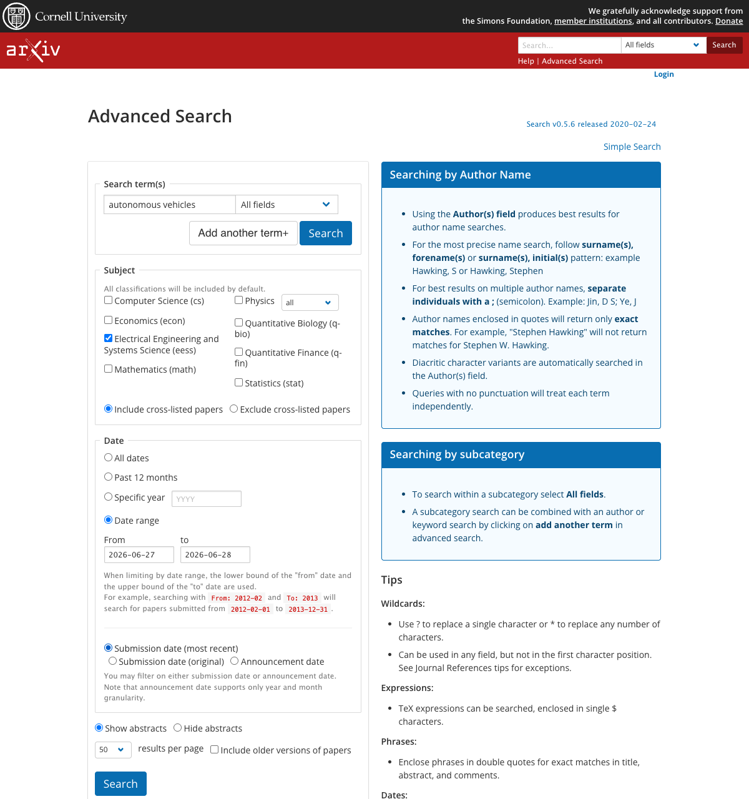

# Case study: full-recorded-ArXiv--23

_Auto-generated from the artifact bundle by_ `scripts/case-study.js`. _Edit the script, not this file._

## Task

- **ID**: `undefined`
- **Site**: ?
- **Verbatim prompt** (from WebVoyager):

  > (unknown)

## Baseline (no skill)

- Verdict: ❌ **NOT SUCCESS**
- Final URL: `https://arxiv.org/search/advanced?terms-0-operator=AND&terms-0-term=autonomous+vehicles&terms-0-field=all&classification-eess=y&classification-physics_archives=all&classification-include_cross_list=include&date-year=&date-filter_by=date_range&date-from_date=2026-06-27&date-to_date=2026-06-28&date-date_type=announced_date_first&abstracts=show&size=50&order=-announced_date_first`
- Final answer: "Clicking the 'Submission date (most recent)' radio button."

### Judge reasoning

> Based on the provided screenshot and result response, the task has not been successfully completed. 
> 
> The user requested to determine the number of articles with the keyword 'autonomous vehicles' published in the 'Electrical Engineering and Systems Science' section of ArXiv yesterday. 
> 
> While the search criteria have been filled out on the Advanced Search page (including the keyword, subject area, date range, and submission date preference), the search itself has not been executed. No search results are displayed, and the final response does not provide the count of articles.
> 
> Verdict: NOT SUCCESS

### Agent trajectory (30 steps)

 0. `click` `y=118 x=801` — Clicking on 'Advanced Search' to access detailed search options.
 1. `click` `x=226 y=255` — Clicking on search term input field.
 2. `type` `text="autonomous vehicles" press_enter=false` — Type "autonomous vehicles" into the search term input box.
 3. `click` `y=255 x=376` — Clicking the field selection dropdown.
 4. `press_key` `key="a"` — Pressing 'a' key to select All fields option in standard dropdown.
 5. `press_key` `key="ArrowUp"` — Pressing ArrowUp to see if 'All fields' is above 'Author(s)'.
 6. `click` `y=255 x=432` — Clicking specifically on the dropdown arrow to open it.
 7. `press_key` `key="ArrowUp"` — Pressing ArrowUp.
 8. `press_key` `key="a"` — Pressing 'a' to select next option starting with 'a'.
 9. `press_key` `key="a"` — Pressing 'a' again to see if it selects 'All fields' or 'ACM class'.
10. `press_key` `key="a"` — Pressing 'a' again.
11. `press_key` `key="a"` — Pressing 'a' again.
12. `press_key` `key="a"` — Pressing 'a' again.
13. `click` `y=432 x=144` — Checking 'Electrical Engineering and Systems Science (eess)' subject checkbox.
14. `click` `x=144 y=650` — Clicking the 'Date range' radio button.
15. `click` `y=696 x=185` — Clicking on the 'From' date range field.
16. `type` `text="2026-06-27" press_enter=false` — Typing '2026-06-27' into the From date field.
17. `click` `y=696 x=292` — Clicking on the 'to' date range field.
18. `type` `text="2026-06-27" press_enter=false` — Typing '2026-06-27' into the to date field.
19. `click` `y=827 x=312` — Clicking the 'Announcement date' radio button.
20. `click` `y=980 x=161` — Clicking the Search button.
21. `click` `y=778 x=285` — Clicking on the 'to' date field to edit it.
22. `double_click` `y=778 x=285` — Double clicking to select the 'to' date text.
23. `hotkey` `keys=["Meta","a"]` — Select all text in the input.
24. `type` `text="2026-06-28" press_enter=false` — Typing '2026-06-28' to replace the selected end date.
25. `scroll` `direction="down" y=500 x=500 magnitude_in_pixels=300` — Scrolling down to locate the Search button.
26. `click` `x=161 y=752` — Clicking the Search button.
27. `click` `x=161 y=241` — Refining the query to search by submission date instead.
28. `click` `x=144 y=810` — Clicking the 'Submission date (most recent)' radio button.
29. `click` `x=144 y=810` — Clicking the 'Submission date (most recent)' radio button.

---

_Re-generate this file with:_ `node scripts/case-study.js full-recorded-ArXiv--23`
